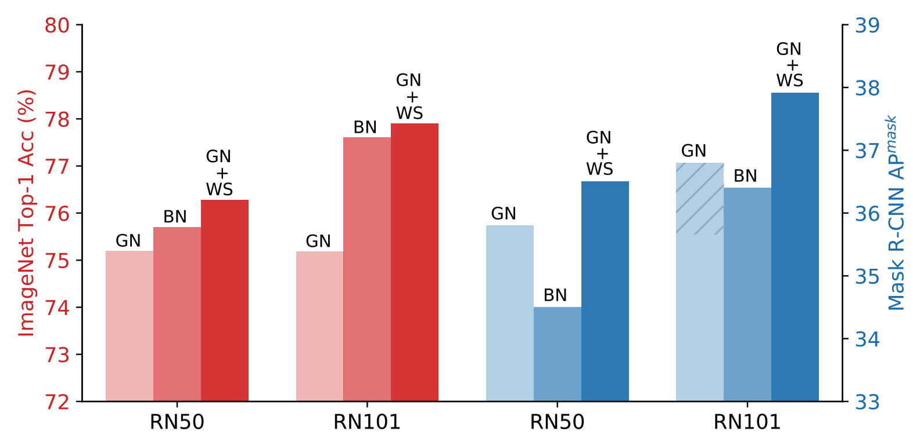
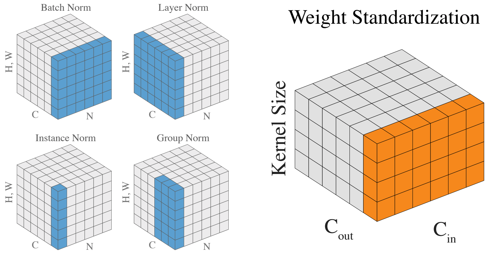

# Weight Standardization

[Weight Standardization](https://arxiv.org/abs/1903.10520) (WS) is a normalization method to accelerate **micro-batch training**.
Micro-batch training is hard because small batch sizes are not enough for
training networks with Batch Normalization (BN), while
other normalization methods that do not rely on batch
knowledge still have difficulty matching the performances
of BN in large-batch training.

**Our WS ends this problem** because when used with Group Normalization and trained
with 1 image/GPU, WS is able to match or outperform the
performances of BN trained with large batch sizes with **only
2 more lines of code**.
So if you are facing any micro-batch training problem, please do yourself a favor and try Weight Standardization.
You will be surprised by how well it performs.

<p float="left">
  
  
</p>

WS achieves these superior results by standardizing the weights in the convolutional layers, which we show is able to smooth the loss landscape by reducing the Lipschitz constants of the loss and the gradients.
Please see our [arXiv](https://arxiv.org/abs/1903.10520) report for the details.
If you find this project helpful, please consider citing our paper.

```
@article{weightstandardization,
  author    = {Siyuan Qiao and Huiyu Wang and Chenxi Liu and Wei Shen and Alan Yuille},
  title     = {Weight Standardization},
  journal   = {arXiv preprint arXiv:1903.10520},
  year      = {2019},
}
```

## Weight Standardization on computer vision tasks
This repo holds our implementations of [Weight Standardization](https://github.com/joe-siyuan-qiao/WeightStandardization) for the following tasks.

| Task | Folder |
|------|:------:|
| ImageNet classification | pytorch-classification |
| Object detection and instance segmentation on COCO | maskrcnn-benchmark |
| Semantic segmentation on PASCAL VOC | DeepLabv3.pytorch |
| Point cloud classification on ModelNet40 | dgcnn |

## Implementing WS as a layer
We provide layer implementation of WS in TensorFlow and PyTorch.
Replacing the convolutional layers with the following ones will give you performance boosts for free.
**NOTE:** only replace convolutional layers that are followed by normalization layers such as BN, GN, etc.
#### PyTorch
```python
class Conv2d(nn.Conv2d):

    def __init__(self, in_channels, out_channels, kernel_size, stride=1,
                 padding=0, dilation=1, groups=1, bias=True):
        super(Conv2d, self).__init__(in_channels, out_channels, kernel_size, stride,
                 padding, dilation, groups, bias)

    def forward(self, x):
        weight = self.weight
        weight_mean = weight.mean(dim=1, keepdim=True).mean(dim=2,
                                  keepdim=True).mean(dim=3, keepdim=True)
        weight = weight - weight_mean
        std = weight.view(weight.size(0), -1).std(dim=1).view(-1, 1, 1, 1) + 1e-5
        weight = weight / std.expand_as(weight)
        return F.conv2d(x, weight, self.bias, self.stride,
                        self.padding, self.dilation, self.groups)
```
#### TensorFlow
```python
kernel_mean = tf.math.reduce_mean(kernel, axis=[0, 1, 2], keepdims=True, name='kernel_mean')
kernel = kernel - kernel_mean
#kernel_std = tf.math.reduce_std(kernel, axis=[0, 1, 2], keepdims=True, name='kernel_std')
kernel_std = tf.keras.backend.std(kernel, axis=[0, 1, 2], keepdims=True)
kernel = kernel / (kernel_std + 1e-5)
```
